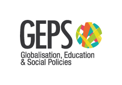

```{=html}
<script type="text/javascript">
    if (window.location.hostname === "desegpol.com") {
        window.location.href = "https://www.desegpol.com" + window.location.pathname;
    }
</script>

<script type="application/ld+json">
{
  "@context": "https://schema.org",
  "@type": "ResearchProject",
  "name": "",
  "description": "Research project analysing the impact of Barcelona's Shock Plan (Pla de Xoc) and the Admissions Decree (Decret d'Admissions) on the distribution of socially vulnerable students across schools in Barcelona.",
  "url": "https://www.desegpol.com",
  "funder": {
  },
  "memberOf": {
    "@type": "Organization",
    "name": "GEPS – Globalisation, Education and Social Policies",
    "parentOrganization": {
      "@type": "CollegeOrUniversity",
      "name": "Universitat Autònoma de Barcelona"
    }
  },
  "keywords": ["school segregation", "desegregation policy", "Barcelona", "education policy", "school choice", "Shock Plan", "Admissions Decree", "equity in education"],
  "about": [
    {
      "@type": "Thing",
      "name": "School segregation"
    },
    {
      "@type": "Thing",
      "name": "Education policy"
    }
  ]
}
</script>
```

{fig-align="center"}

::: {style="display: flex; justify-content: center; align-items: center; flex-wrap: wrap;"}
 
:::

**Research project funded by**

::: {style="display: flex; justify-content: center; align-items: center;"}

:::

```{=html}
<script defer src="https://cdn.overtracking.com/t/tJ4dxONKAlXCjw0k8/"></script>
```
