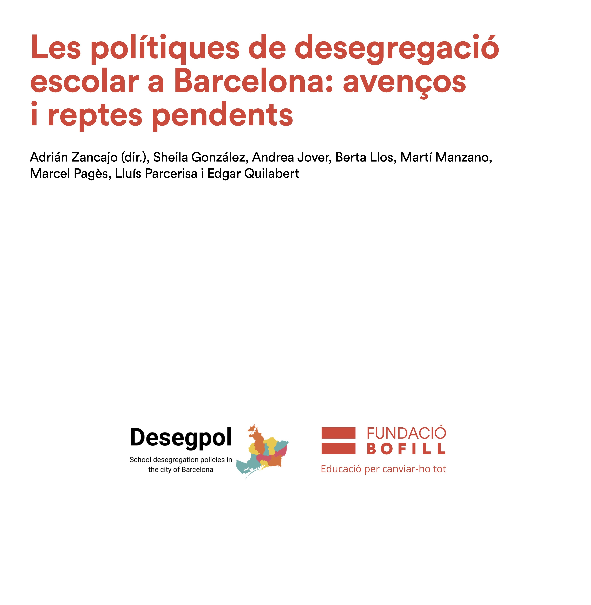
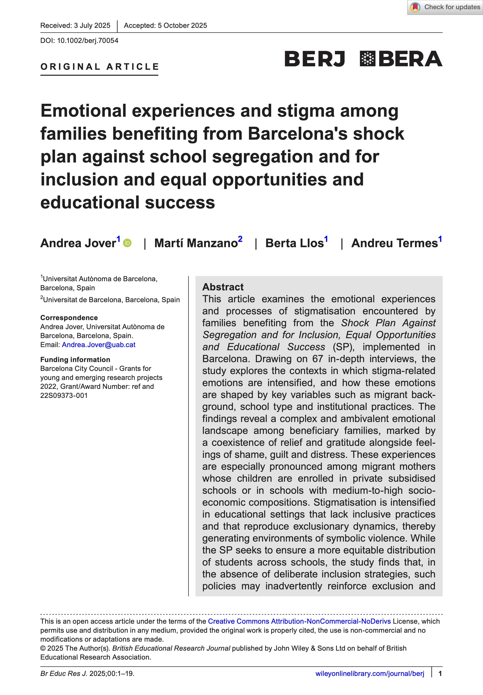
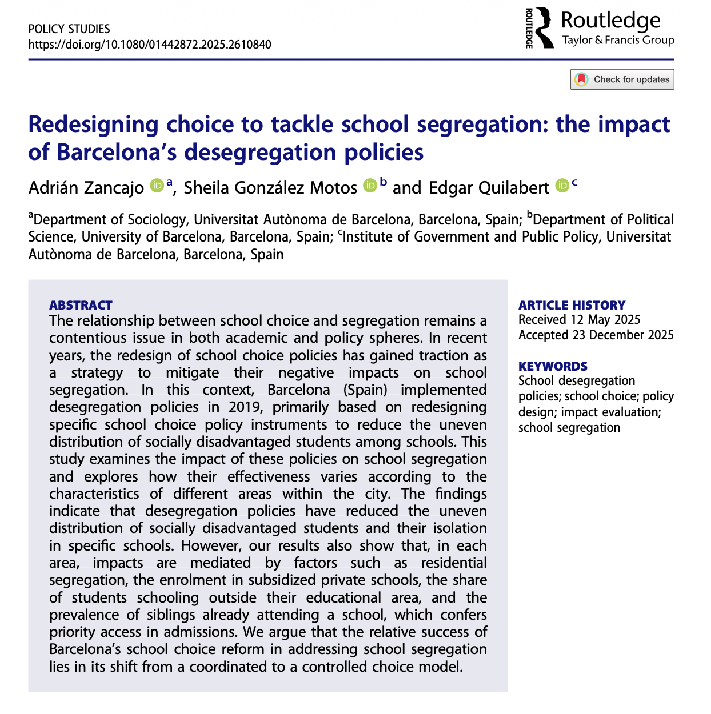

::::: {.publication-card style="display: flex; background-color: #fdfdfd; box-shadow: 0 0px 12px rgba(54,142,138,0.1); padding: 3rem; border-radius: 12px;"}
::: {style="flex: 1; margin-right: 1.5rem;"}

:::

::: {style="flex: 2;"}
**School desegregation policies in Barcelona: progress and remaining challenges (Catalan)**

This policy brief, edited together with Fundació Bofill, synthesizes the main findings of the research project.

[**Download the document**](https://fundaciobofill.cat/uploads/docs/6/m/r/wh0-politiquesdesegregacioescolarabarcelona_adriazacncajo_2aed.pdf)
:::
:::::

::::: {.publication-card style="display: flex; background-color: #fdfdfd; box-shadow: 0 0px 12px rgba(54,142,138,0.1); padding: 3rem; border-radius: 12px;"}
::: {style="flex: 1; margin-right: 1.5rem;"}

:::

::: {style="flex: 2;"}
**Emotional experiences and stigma among families benefiting from Barcelona's shock plan against school segregation and for inclusion and equal opportunities and educational success**

This article examines the emotional experiences and processes of stigmatisation encountered by families benefiting from the Shock Plan Against Segregation and for Inclusion, Equal Opportunities and Educational Success in Barcelona.

[**Download the document**](https://bera-journals.onlinelibrary.wiley.com/doi/epdf/10.1002/berj.70054)
:::
:::::

::::: {.publication-card style="display: flex; background-color: #fdfdfd; box-shadow: 0 0px 12px rgba(54,142,138,0.1); padding: 3rem; border-radius: 12px;"}
::: {style="flex: 1; margin-right: 1.5rem;"}

:::

::: {style="flex: 2;"}
**Redesigning choice to tackle school segregation: the impact of Barcelona’s desegregation policies**

This study examines the impact of these policies on school segregation and explores how their effectiveness varies according to the characteristics of different areas within the city. The findings indicate that desegregation policies have reduced the uneven distribution of socially disadvantaged students and their isolation in specific schools.

[**Download the document**](https://tinyurl.com/34b8wcfp)

[**Pre-printed version**](https://tinyurl.com/yzu9wcvb)
:::
:::::
